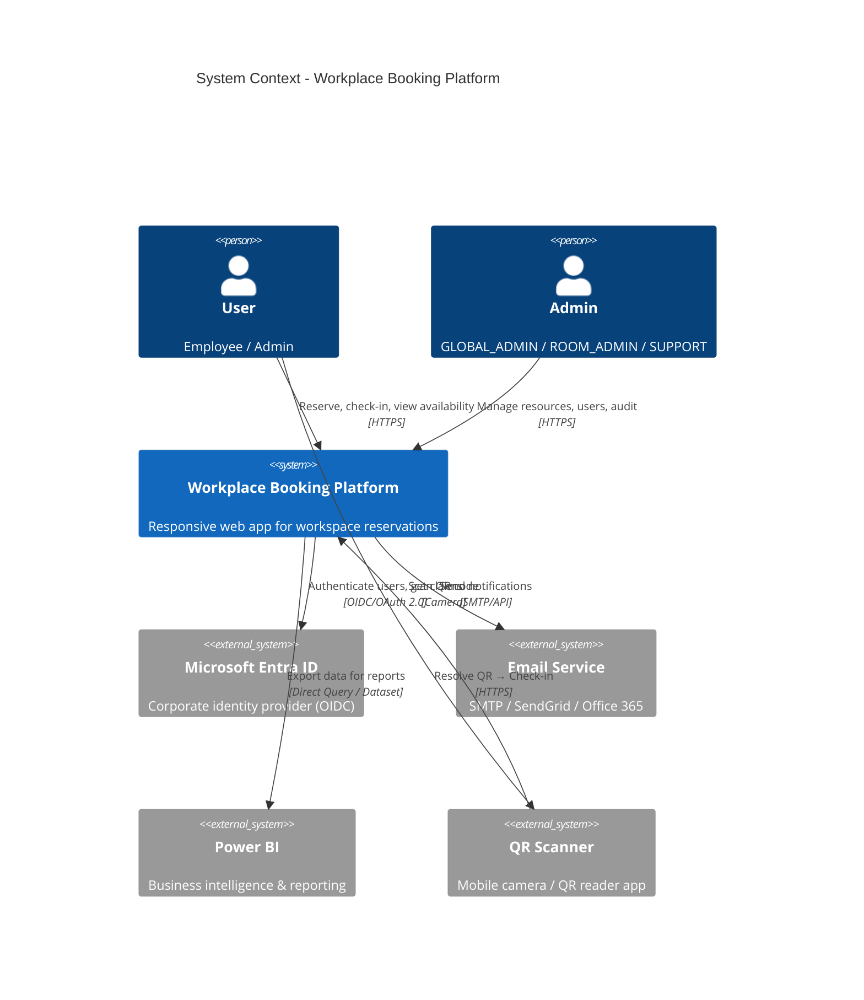
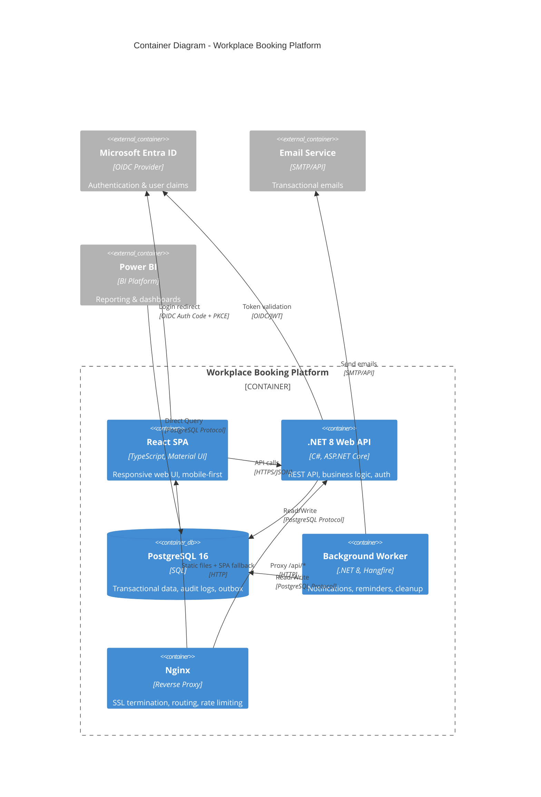
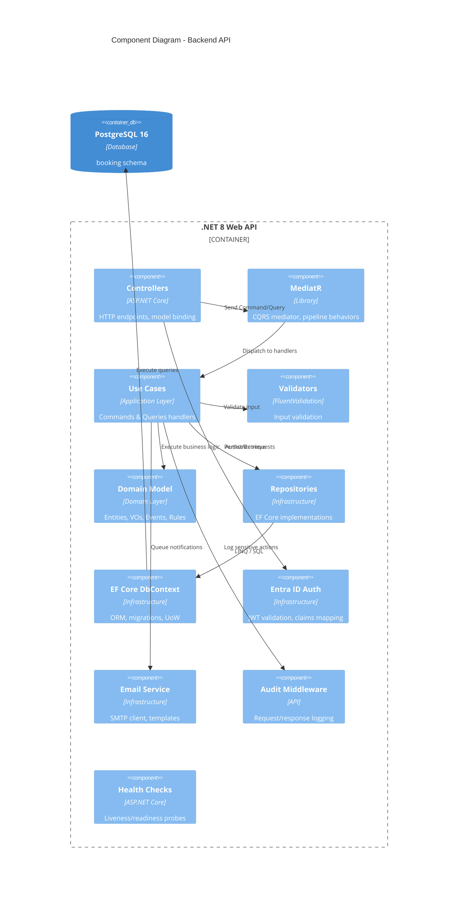
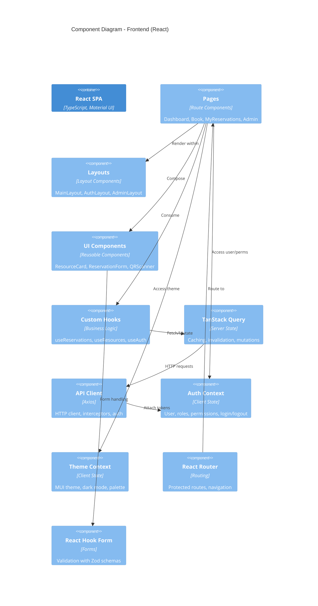
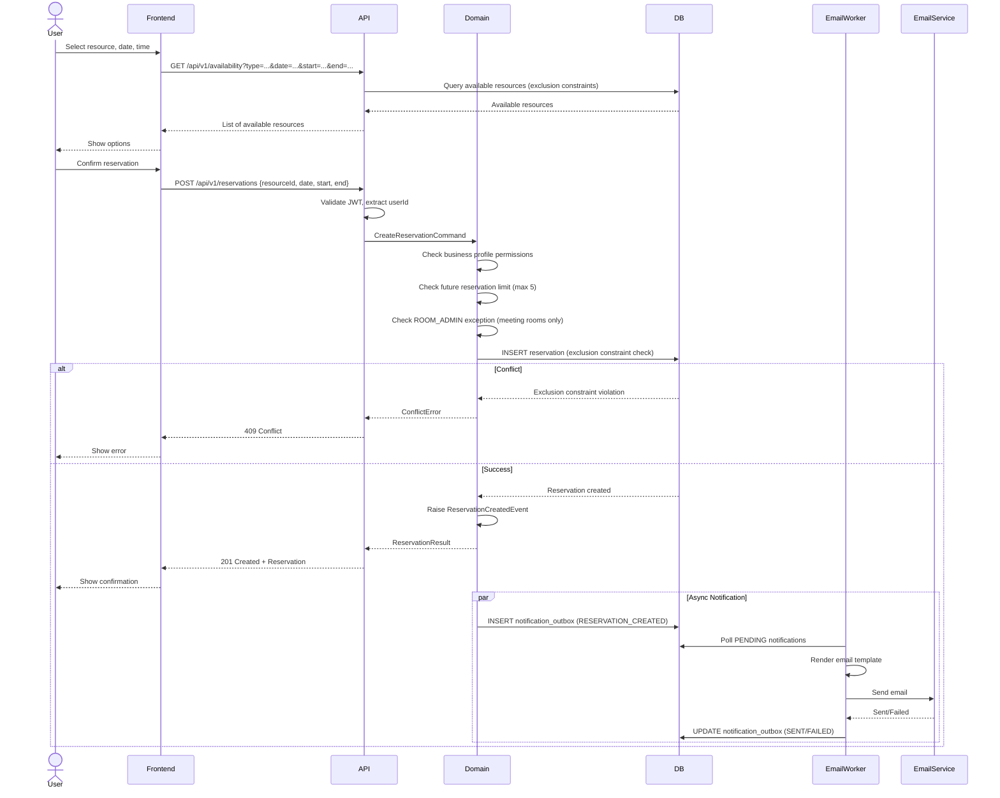
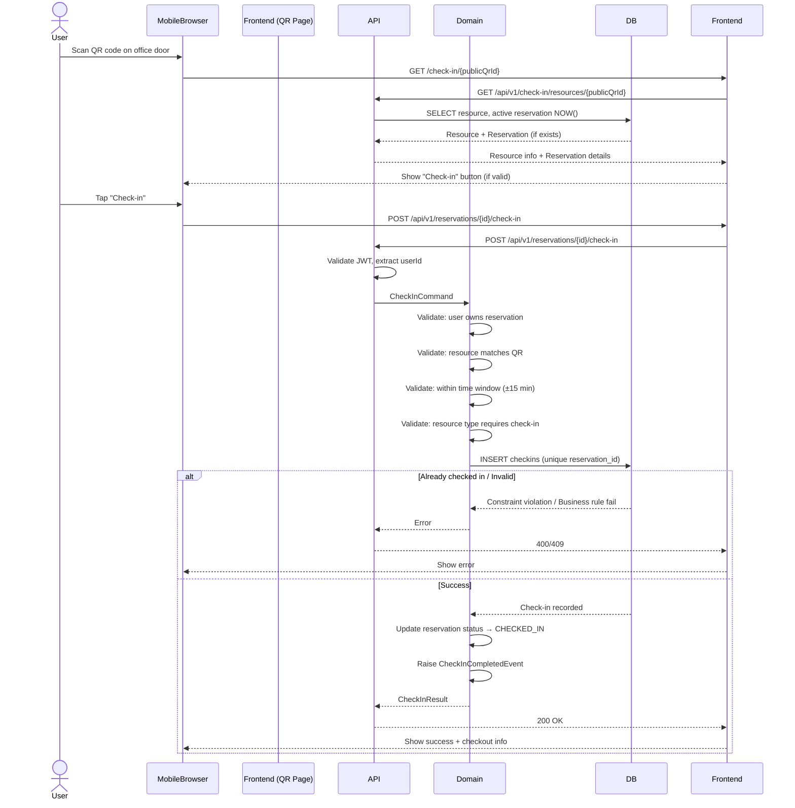
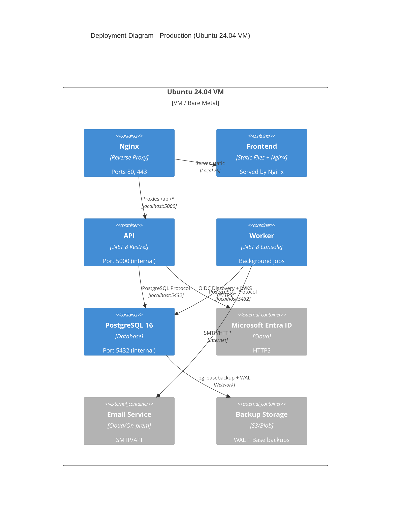
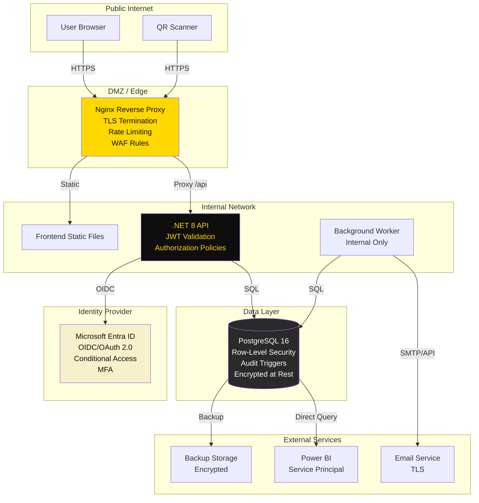
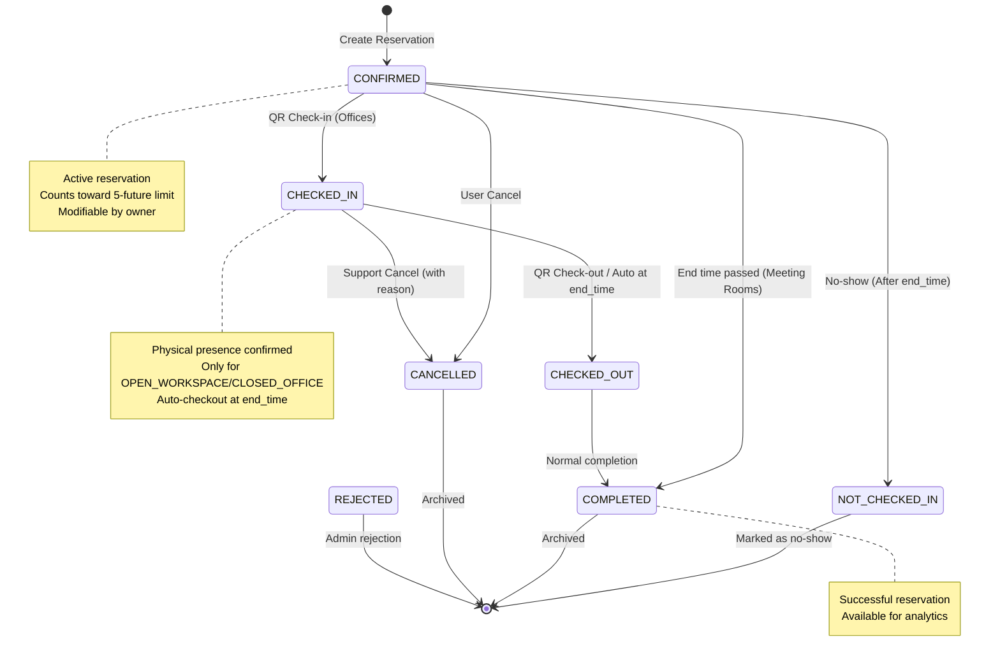

# Workplace Booking Platform - Architecture Diagrams

## 1. System Context Diagram (C4 Level 1)



## 2. Container Diagram (C4 Level 2)



## 3. Component Diagram - Backend (C4 Level 3)



## 4. Component Diagram - Frontend



## 5. Database ER Diagram

```mermaid
erDiagram
    LOCATIONS ||--o{ FLOORS : has
    FLOORS ||--o{ ZONES : contains
    FLOORS ||--o{ RESOURCES : hosts
    ZONES ||--o{ RESOURCES : groups
    RESOURCE_TYPES ||--o{ RESOURCES : categorizes
    
    APP_USERS ||--o{ USER_BUSINESS_PROFILES : has
    BUSINESS_PROFILES ||--o{ USER_BUSINESS_PROFILES : assigned
    APP_USERS ||--o{ USER_APPLICATION_ROLES : has
    APPLICATION_ROLES ||--o{ USER_APPLICATION_ROLES : assigned
    APP_USERS ||--o{ RESERVATIONS : creates
    APP_USERS ||--o{ RESERVATIONS : owns
    APP_USERS ||--o{ CHECKINS : performs
    APP_USERS ||--o{ NOTIFICATION_OUTBOX : receives
    APP_USERS ||--o{ AUDIT_LOGS : acts_as
    
    RESOURCES ||--o{ RESERVATIONS : booked_via
    RESOURCES ||--o{ CHECKINS : checked_into
    RESOURCE_TYPES ||--o{ RESOURCE_ACCESS_POLICIES : governs
    BUSINESS_PROFILES ||--o{ RESOURCE_ACCESS_POLICIES : permits
    
    RESERVATIONS ||--|| CHECKINS : generates
    RESERVATIONS ||--o{ NOTIFICATION_OUTBOX : triggers
    RESERVATION_EXCEPTIONS }|--|| APP_USERS : grants
    RESOURCE_TYPES ||--o{ RESERVATION_EXCEPTIONS : applies_to
    
    APP_SETTINGS {
        uuid id PK
        int maximum_future_active_reservations
        int maximum_advance_days
        int minimum_duration_minutes
        time latest_end_time
        int reminder_minutes_before
        bool allow_cross_day_booking
        bool show_occupant_name_to_users
    }
    
    LOCATIONS {
        uuid id PK
        string code UK
        string name
        string city
        string country
        string timezone
        bool active
    }
    
    FLOORS {
        uuid id PK
        uuid location_id FK
        int floor_number
        string code
        string name
        bool active
    }
    
    ZONES {
        uuid id PK
        uuid floor_id FK
        string code
        string name
        bool active
    }
    
    RESOURCE_TYPES {
        string code PK
        string name
        bool qr_required
        bool checkin_required
        bool active
    }
    
    RESOURCES {
        uuid id PK
        string code UK
        string name
        string resource_type_code FK
        uuid location_id FK
        uuid floor_id FK
        uuid zone_id FK
        int capacity
        uuid public_qr_id UK
        int qr_version
        bool active
        bool reservable
    }
    
    APP_USERS {
        uuid id PK
        uuid entra_object_id UK
        citext email UK
        string display_name
        string job_title
        string department
        bool active
        timestamptz last_login_at
    }
    
    BUSINESS_PROFILES {
        string code PK
        string name
        bool active
    }
    
    APPLICATION_ROLES {
        string code PK
        string name
        string description
        bool active
    }
    
    USER_BUSINESS_PROFILES {
        uuid id PK
        uuid user_id FK
        string profile_code FK
        date valid_from
        date expires_at
        bool active
    }
    
    USER_APPLICATION_ROLES {
        uuid id PK
        uuid user_id FK
        string role_code FK
        date valid_from
        date expires_at
        bool active
    }
    
    RESOURCE_ACCESS_POLICIES {
        uuid id PK
        string resource_type_code FK
        string business_profile_code FK
        bool can_view
        bool can_reserve
        bool can_modify_own
        bool active
    }
    
    RESERVATION_EXCEPTIONS {
        uuid id PK
        uuid user_id FK
        int maximum_future_active_reservations
        string applies_to_resource_type_code FK
        date valid_from
        date expires_at
        string reason
        bool active
    }
    
    RESERVATIONS {
        uuid id PK
        uuid resource_id FK
        uuid user_id FK
        uuid created_by_user_id FK
        date reservation_date
        time start_time
        time end_time
        reservation_status status
        string title
        string description
        int attendee_count
        string support_change_reason
        timestamptz checked_in_at
        timestamptz checked_out_at
        timestamptz cancelled_at
        uuid cancelled_by_user_id FK
        string cancellation_reason
    }
    
    CHECKINS {
        uuid id PK
        uuid reservation_id FK UK
        uuid resource_id FK
        uuid user_id FK
        checkin_method method
        uuid scanned_public_qr_id
        timestamptz checked_in_at
        inet ip_address
        string user_agent
    }
    
    NOTIFICATION_OUTBOX {
        uuid id PK
        uuid reservation_id FK
        uuid recipient_user_id FK
        citext recipient_email
        notification_type type
        string subject
        string body
        timestamptz scheduled_at
        timestamptz sent_at
        notification_status status
        int retry_count
        string last_error
    }
    
    AUDIT_LOGS {
        uuid id PK
        uuid actor_user_id FK
        string action
        string entity_name
        uuid entity_id
        jsonb before_value
        jsonb after_value
        string reason
        inet ip_address
        string user_agent
        uuid correlation_id
        timestamptz created_at
    }
```

## 6. Sequence Diagram - Create Reservation



## 7. Sequence Diagram - QR Check-in



## 8. Deployment Diagram



## 9. Data Flow - Notification Processing

```mermaid
flowchart TD
    A[Business Event\n(Reservation Created/\nModified/Cancelled)] --> B{Domain Event\nRaised}
    B --> C[Insert into\nnotification_outbox\nPENDING]
    C --> D[Background Worker\n(Polls every 60s)]
    D --> E{Type == REMINDER?}
    E -->|Yes| F[Check scheduled_at\n<= NOW + 15min]
    E -->|No| G[Process Immediately]
    F --> H{Due?}
    H -->|Yes| G
    H -->|No| I[Skip this cycle]
    G --> J[Render Template\nwith Reservation Data]
    J --> K[Send via Email Service]
    K --> L{Success?}
    L -->|Yes| M[UPDATE status=SENT\nsent_at=NOW]
    L -->|No| N[Increment retry_count\nStore last_error]
    N --> O{retry_count < 3?}
    O -->|Yes| P[Reschedule with\nExponential Backoff]
    O -->|No| Q[UPDATE status=FAILED\nAlert Admin]
    P --> C
    M --> R[Log Audit Trail]
    Q --> R
    R --> S[End]
    I --> S
```

## 10. Security Boundaries



## 11. State Machine - Reservation Lifecycle



## 12. API Gateway / Routing

```mermaid
flowchart LR
    subgraph "Nginx Routes"
        A[/] --> FE[Frontend SPA]
        B[/api/v1/*] --> API[API Controllers]
        C[/health*] --> HC[Health Checks]
        D[/check-in/*] --> FE
        E[/assets/*] --> FE[Static Assets]
        F[/*.well-known/*] --> ENTRA[Entra ID Discovery]
    end
    
    subgraph "API Controller Routes"
        API --> R1[ResourcesController]
        API --> R2[ReservationsController]
        API --> R3[CheckInController]
        API --> R4[AdminController]
        API --> R5[AuthController]
    end
    
    subgraph "Authorization Policies"
        R1 --> P1[RequireAuthenticatedUser]
        R2 --> P2[RequireReservationAccess]
        R3 --> P3[RequireCheckInPermission]
        R4 --> P4[RequireAdminRole]
        R5 --> P5[AllowAnonymous]
    end
    
    style NGINX fill:#ffd800,color:#0e0e0e
```

---

*All diagrams use Mermaid.js syntax. Render in GitHub, VS Code, or any Mermaid-compatible viewer.*